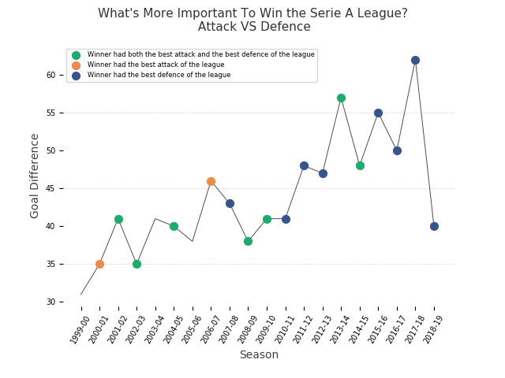

# What is More Important to Win the Serie A League: Attack or Defence?

This is the project I made to complete the [Applied Plotting, Charting & Data Representation in Python](https://www.coursera.org/learn/python-plotting?specialization=data-science-python) course, which is the second course in the "Applied Data Science With Python Specialization" by University of Michigan on Coursera.

If you want more info about this project, check out the [article]() I wrote about it.

## Assignment
*This assignment requires that you to find **at least** two datasets on the web which are related, and that you visualize these datasets to answer a question with the broad topic of **sport and athletics** (see below) for the region of **Italy**.*

*You can merge these datasets with data from different regions if you like!*
*You are welcome to upload datasets of your own as well, and link to them using a third party repository such as github, bitbucket, pastebin, etc. Please be aware of the Coursera terms of service with respect to intellectual property.*

*As this assignment is for the whole course, you must incorporate principles discussed in the first week, such as having as high data-ink ratio (Tufte) and aligning with Cairo’s principles of truth, beauty, function, and insight.*

# The Question
What comes to mind thinking about the words sport and Italy? **Football.**

Like most Italians, I am also a football fan. So I decided to find an answer once and for all to one of the most frequently asked questions in this sport:

***What is more important to win the Serie A league: attack or defence?***

# Getting the Data
The data have been scraped from **legaseriea.it**. I scraped the final table of the league of the last 20 years (1999-2019). [Here]() is the scraper

# EDA
Take a look to the Jupyter notebook to see the exploratory data analysis

# The Answer

The visual clearly shows the answer to our question. 

**Having a great defence is critical to the final victory.**

In fact, as can be seen, in 15 of the past 20 years the winning team had the best defence in the league, including:
* 8 times with only the best defence (blue dots)
* 7 times with both best attack and best defence (green dots). 

Only 5 times (1999–00, 2000–01, 2003–04, 2005–06, 2006–07) in the last 20 years the winner did not have the best defence in the league.
